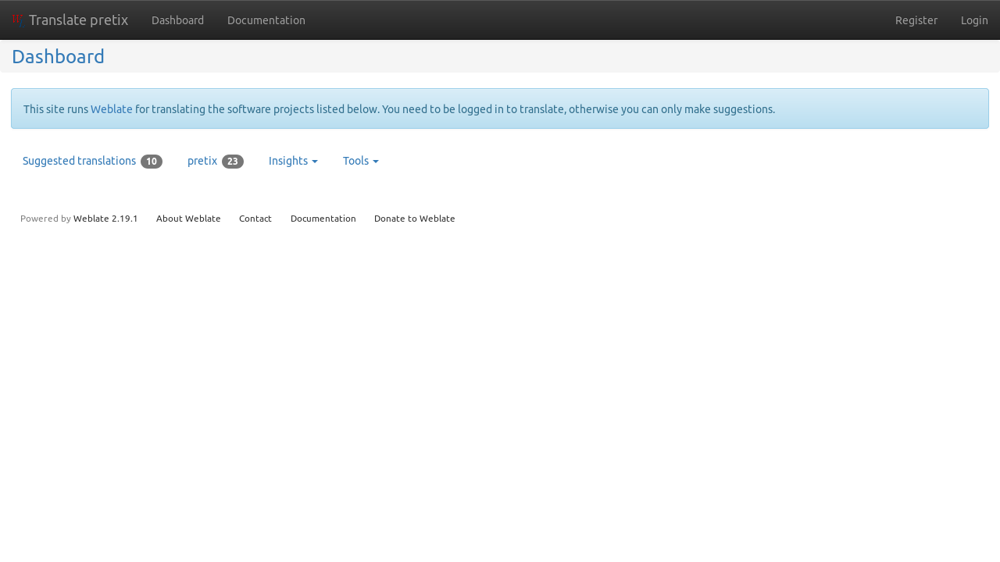
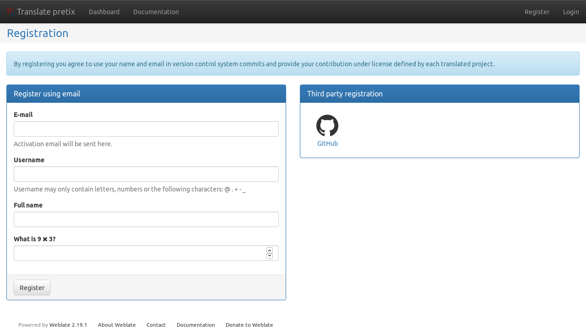
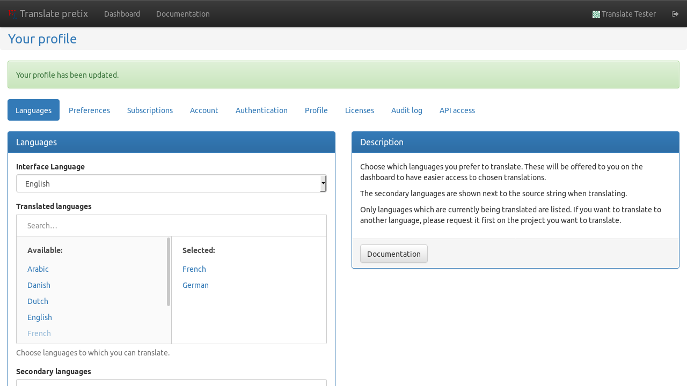
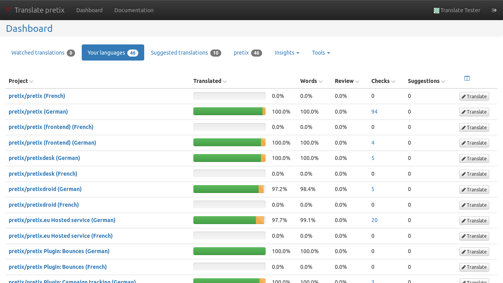
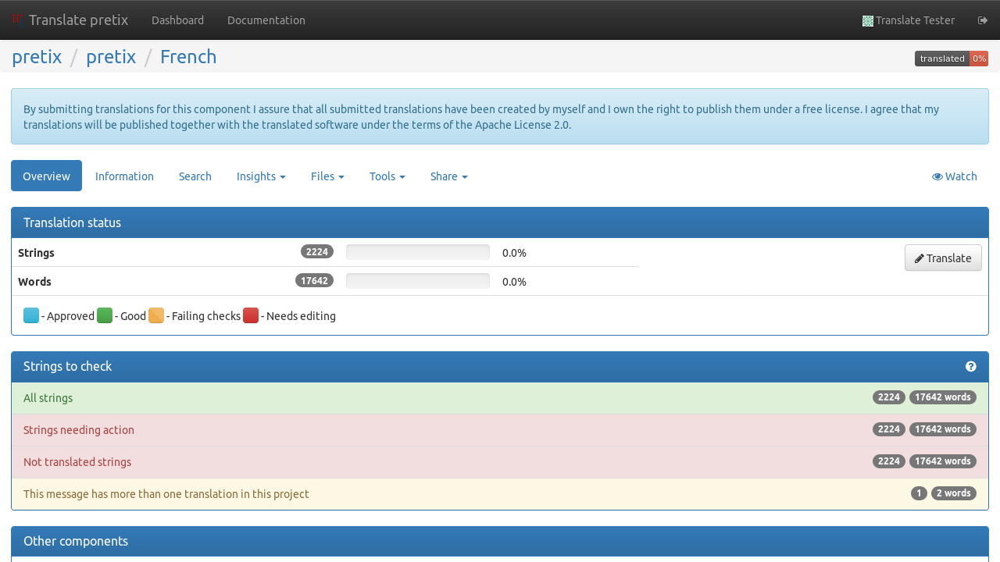
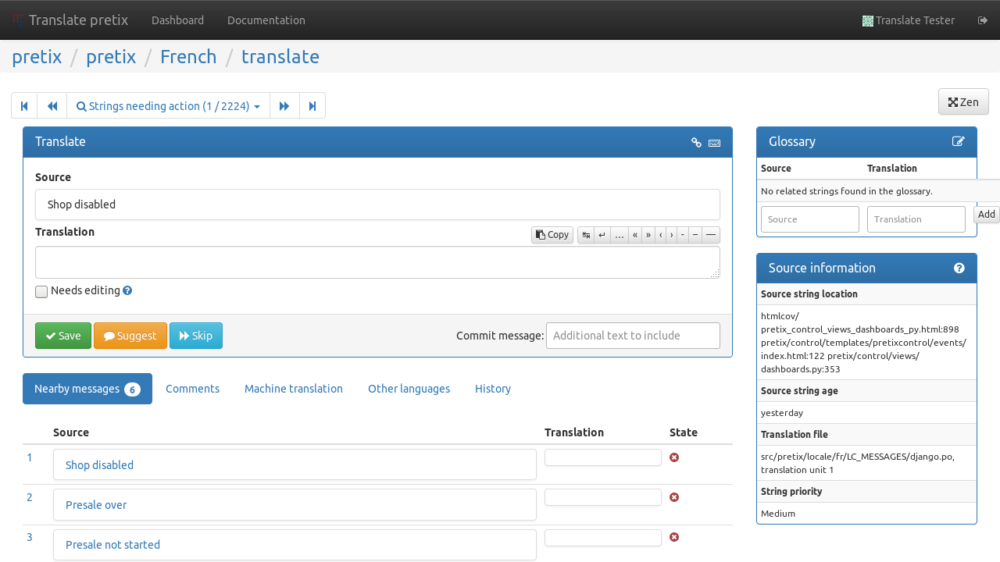

Translating pretix
==================

pretix has been designed for multi-language capabilities from its start. Organizers can enter their event information
in multiple languages at the same time. However, the software interface of pretix also needs to be translated for
this to be useful.

Since we (the developers of pretix) only speak a very limited number of languages, we need help from the community
to achieve this goal. To make translating pretix easy not only for software developers, we set up a translation
platform at `translate.pretix.eu`_.

Official and inofficial languages
---------------------------------

In the pretix project, there are three types of languages:

Official languages
    are translated and maintained by the core team behind pretix or as part of long-term partnerships. We are
    committed to keeping these translations up-to-date with new features or changes in pretix and try to offer
    support in this language.

Inofficial languages
    are contributed and maintained by the Community. We ship them with pretix so you can use them, but we can not
    guarantee that new or changed features in pretix will be translated in time.

Incubating languages
    are currently in the process of being translated. They can not yet be selected in pretix by end users on
    production installations and are only available in development mode for testing.

Please contact translate@pretix.eu if you think an incubated language should be promoted to an inofficial one or if
you are interested in a partnership to make your language official.

The current translation status of various languages is:

.. image:: https://translate.pretix.eu/widgets/pretix/-/multi-blue.svg
   :target: https://translate.pretix.eu/engage/pretix/?utm_source=widget

Using our translation platform
------------------------------

If you visit `translate.pretix.eu`_ for the first time, it admittedly looks pretty bare.

It gets better if you create an account, which you will need to contribute translations. Click on "Register" in the
top-right corner to get started:

You can either create an account or choose to log in with your GitHub account, whichever you like more.
After creating and activating your account, we recommend that you change your profile and select which languages you
can translate to and which languages you understand. You can find your profile settings by clicking on your name in
the top-right corner.

Going back to the dashboard by clicking on the logo in the top-left corner, you can select between different lists
of translation projects. You can either filter by projects that already have a translation in your language, or you
go to the `pretix project page`_ where you can select specific components.

.. note::

   If you want to translate pretix to a new language that is not yet listed here, you are very welcome to do so!
   While you technically can add the language to the portal yourself, we ask you to drop us a short mail to
   translate@pretix.eu so we can add it to all components at once and also make it selectable in pretix itself.

Once you selected a component of a language, you can start going through strings to translate. You can start of by
clicking the "Strings needing action" line in this view:

In the translate view, you can input your translation for a given source string. If you're unsure about your
translation, you can also just "Suggest" it or mark it as "Needs editing". If you have no idea, just "Skip". If you
scroll down, there is also a "Comments" section to discuss any questions with fellow translators or us developers.

.. _translate.pretix.eu: https://translate.pretix.eu
.. _pretix project page: https://translate.pretix.eu/projects/pretix/
