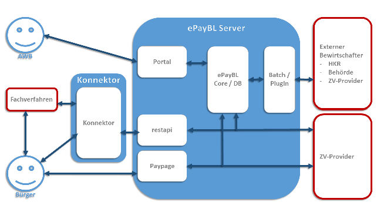

ePayBL
======

.. note::

    Since ePayBL is only available to german federal, provincial and communal entities, the following page is also
    only provided in german. Should you require assistance with ePayBL and do not speak this language, please feel free
    reach out to support@pretix.eu.

Einführung
----------

.. note::

    Sollten Sie lediglich schnell entscheiden wollen, welcher Kontierungsmodus in den Einstellungen des pretix
    ePayBL-plugins gewählt werden soll, so springen Sie direkt zur Sektion :ref:`Kontierungsmodus`.

`ePayBL`_ - das ePayment-System von Bund und Länder - ist das am weitesten verbreitete Zahlungssystem für Bundes-, Länder-
sowie kommunale Aufgabenträger. Während es nur wie eines von vielen anderen Zahlungssystemen scheint, so bietet es
seinen Nutzern besondere Vorteile, wie die automatische Erfassung von Zahlungsbelegen, dem Übertragen von Buchungen in
Haushaltskassen/-systeme sowie die automatische Erfassung von Kontierungen und Steuermerkmalen.

Rein technisch gesehen ist ePayBL hierbei nicht ein eigenständiger Zahlungsdienstleister sondern nur ein eine Komponente
im komplexen System, dass die Zahlungsabwicklung für Kommunen und Behörden ist.

Im folgenden der schematische Aufbau einer Umgebung, in welcher ePayBL zum Einsatz kommt:

   Quelle: Integrationshandbuch ePayBL-Konnektor, DResearch Digital Media Systems GmbH

In diesem Schaubild stellt pretix, bzw. die von Ihnen als Veranstalter angelegten Ticketshops, das Fachverfahren dar.

ePayBL stellt das Bindeglied zwischen den Fachverfahren, Haushaltssystemen und dem eigentlichen Zahlungsdienstleister,
dem sog. ZV-Provider dar. Dieser ZV-Provider ist die Stelle, welche die eigentlichen Kundengelder einzieht und an den
Händler auszahlt. Das Gros der Zahlungsdienstleister unterstützt pretix hierbei auch direkt; sprich: Sollten Sie die
Anbindung an Ihre Haushaltssysteme nicht benötigen, kann eine direkte Anbindung in der Regel ebenso - und dies bei meist
vermindertem Aufwand - vorgenommen werden.

In der Vergangenheit zeigte sich jedoch schnell, dass nicht jeder IT-Dienstleister immer sofort die neueste Version von
ePayBL seinen Nutzern angeboten hat. Die Gründe hierfür sind mannigfaltig: Von fest vorgegebenen Update-Zyklen bis hin
zu Systeme mit speziellen Anpassungen, kann leider nicht davon ausgegangen werden, dass alle ePayBL-Systeme exakt gleich
ansprechbar sind - auch wenn es sich dabei eigentlich um einen standardisierten Dienst handelt.

Aus diesem Grund gibt es mit dem ePayBL-Konnektor eine weitere Abstraktionsschicht welche optional zwischen den
Fachverfahren und dem ePayBL-Server sitzt. Dieser Konnektor wird so gepflegt, dass er zum einen eine dauerhaft
gleichartige Schnittstelle den Fachverfahren bietet aber gleichzeitig auch mit jeder Version des ePayBL-Servers
kommunizieren kann - egal wie neu oder alt, wie regulär oder angepasst diese ist.

Im Grunde müsste daher eigentlich immer gesagt werden, dass pretix eine Anbindung an den ePayBL-Konnektor bietet; nicht
an "ePayBL" oder den "ePayBL-Server". Diese Unterscheidung kann bei der Ersteinrichtung und Anforderung von Zugangsdaten
von Relevanz sein. Da in der Praxis jedoch beide Begriffe gleichbedeutend genutzt werden, wird im Folgenden auch nur von
einer ePayBL-Anbindung die Rede sein - auch wenn explizit der Konnektor gemeint ist.

.. _`Kontierungsmodus`:

Kontierungsmodus
----------------

ePayBL ist ein Produkt, welches für die Abwicklung von Online-Zahlungsvorgängen in der Verwaltung geschaffen wurde. Ein
Umfeld, in dem klar definiert ist, was ein Kunde gerade bezahlt und wohin das Geld genau fließt. Diese Annahmen lassen
sich in einem Ticketshop wie pretix jedoch nur teilweise genauso abbilden.

Die ePayBL-Integration für pretix bietet daher zwei unterschiedliche Modi an, wie Buchungen erfasst und an ePayBL und
damit auch an die dahinterliegenden Haushaltssysteme gemeldet werden können.

Kontierung pro Position/Artikel
^^^^^^^^^^^^^^^^^^^^^^^^^^^^^^^

Dieser Modus versucht den klassischen, behördentypischen ePayBL-Zahlungsvorgang abzubilden: Jede einzelne Position, die
ein Kunde in den Warenkorb legt, wird auch genauso 1:1 an ePayBL und die Hintergrundsysteme übermittelt.

Hierbei muss zwingend auch für jede Position ein Kennzeichen für Haushaltsstelle und Objektnummer, sowie optional ein
Kontierungsobjekt (``HREF``; bspw. ``stsl=Steuerschlüssel;psp=gsb:Geschäftsbereich,auft:Innenauftrag,kst:Kostenstelle;``
) übermittelt werden.

Diese Daten sind vom Veranstalter entsprechend für jeden in der Veranstaltung angelegten Artikel innerhalb des Tabs
"Zusätzliche Einstellungen" der Produkteinstellungen zu hinterlegen.

Während diese Einstellung eine größtmögliche Menge an Kontierungsdaten überträgt und auch ein separates Verbuchen von
Leistungen auf unterschiedliche Haushaltsstellen erlaubt, so hat diese Option auch einen großen Nachteil: Der Kunde kann
nur eine Zahlung für seine Bestellung leisten.

Während sich dies nicht nach einem großen Problem anhört, so kann dies beim Kunden zu Frust führen. pretix bietet die
Option an, dass ein Veranstalter eine Bestellung jederzeit verändern kann: Ändern von Preisen von Positionen in einer
aufgegebenen Bestellung, Zubuchen und Entfernen von Bestellpositionen, etc. Hat der Kunde seine ursprüngliche Bestellung
jedoch schon bezahlt, kann pretix nicht mehr die komplette Bestellung mit den passenden Kontierungen übertragen - es
müsste nur ein Differenz-Abbild zwischen Ursprungsbestellung und aktueller Bestellung übertragen werden. Aber auch wenn
eine "Nachmeldung" möglich wäre, so wäre ein konkretes Auflösen für was jetzt genau gezahlt wird, nicht mehr möglich.

Daher gilt bei der Nutzung der Kontierung pro Position/Artikel: Der Kunde kann nur eine (erfolgreiche) Zahlung auf seine
Bestellung leisten.

Eine weitere Einschränkung dieses Modus ist, dass aktuell keine Gebühren-Positionen (Versandkosten, Zahlungs-, Storno-
oder Servicegebühren) in diesem Modus übertragen werden können. Bitte wenden Sie sich an uns, wenn Sie diese
Funktionalität benötigen.

Kontierung pro Zahlvorgang
^^^^^^^^^^^^^^^^^^^^^^^^^^

Dieser Modus verabschiedet sich vom behördlichen "Jede Position gehört genau zu einem Haushaltskonto und muss genau
zugeordnet werden". Stattdessen werden alle Bestellpositionen - inklusive eventuell definierter Gebühren - vermengt und
nur als ein großer Warenkorb, genauer gesagt: eine einzige Position an ePayBL sowie die Hintergrundsysteme gemeldet.

Während im "pro Postion/Artikel"-Modus jeder Artikel einzeln übermittelt wird und damit auch korrekt pro Artikel der
jeweilige Brutto- und Nettopreis, sowie der anfallende Steuerbetrag und ein Steuerkennzeichen (mit Hilfe des optionalen
``HREF``-Attributs) übermittelt werden, ist dies im "pro Zahlvorgang"-Modus nicht möglich.

Stattdessen übermittelt pretix nur einen Betrag für den gesamten Warenkorb: Bruttopreis == Nettopreis. Der Steuerbetrag
wird hierbei als 0 übermittelt.

Die Angabe einer Haushaltsstelle und Objektnummer, sowie optional der ``HREF``-Kontierungsinformationen ist jedoch
weiterhin notwendig - allerdings nicht mehr individuell für jeden Artikel/jede Position sondern nur für die gesamte
Bestellung. Diese Daten sind direkt in den ePayBL-Einstellungen der Veranstaltung unter Einstellungen -> Zahlung ->
ePayBL vorzunehmen

In der Praxis bedeutet dies, dass in einem angeschlossenen Haushaltssystem nicht nachvollzogen kann, welche Positionen
konkret erworben und bezahlt wurden - stattdessen kann nur der Fakt, dass etwas verkauft wurde erfasst werden.

Je nach Aufbau und Vorgaben der Finanzbuchhaltung kann dies jedoch ausreichend sein - wenn bspw. eine Ferienfahrt
angeboten wird und seitens der Haushaltssysteme nicht erfasst werden muss, wie viel vom Gesamtbetrag einer Bestellung
auf die Ferienfahrt an sich, auf einen Zubringerbus und einen Satz Bettwäsche entfallen ist, sondern (vereinfacht
gesagt) es ausreichend ist, dass "Eine Summe X für die Haushaltsstelle/Objektnummer geflossen ist".

Dieser Modus der Kontierung bietet Ihnen auch als Vorteil gegenüber dem vorhergehenden an, dass die Bestellungen der
Kunden jederzeit erweitert und verändert werden können - auch wenn die Ursprungsbestellung schon bezahlt wurde und nur
noch eine Differenz gezahlt wird.

Einschränkungen
---------------

Zum aktuellen Zeitpunkt erlaubt die pretix-Anbindung an ePayBL nicht das durchführen von Erstattungen von bereits
geleisteten Zahlungen. Der Prozess hierfür unterscheidet sich von Behörde zu Behörde und muss daher händisch
durchgeführt werden.

.. _ePayBL: https://www.epaybl.de/
