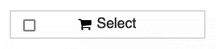

.. _widget:

Embeddable Widget
=================

If you want to show your ticket shop on your event website or blog, you can use our JavaScript widget. This way,
users will not need to leave your site to buy their ticket in most cases.

To obtain the correct HTML code for embedding your event into your website, we recommend that you go to the "Widget"
tab of your event's settings. You can specify some optional settings there (for example the language of the widget)
and then click "Generate widget code".

.. thumbnail:: ../../screens/event/widget_form.png
   :align: center
   :class: screenshot

You will obtain two code snippets that look *roughly* like the following. The first should be embedded into the
``<head>`` part of your website, if possible. If this inconvenient, you can put it in the ``<body>`` part as well::

    <link rel="stylesheet" type="text/css" href="https://pretix.eu/demo/democon/widget/v1.css" crossorigin>
    

The second snippet should be embedded at the position where the widget should show up::

    <pretix-widget event="https://pretix.eu/demo/democon/"></pretix-widget>
    <noscript>
       

            

                JavaScript is disabled in your browser. To access our ticket shop without JavaScript,
                please <a target="_blank" href="https://pretix.eu/demo/democon/">click here</a>.
            

        

    </noscript>

.. note::

    You can of course embed multiple widgets of multiple events on your page. In this case, please add the first
    snippet only *once* and the second snippets once *for each event*.

.. note::

    Some website builders like Jimdo have trouble with our custom HTML tag. In that case, you can use
    ``

`` instead of ``<pretix-widget …></pretix-widget>`` starting with
    pretix 1.14.

Example
-------

Your embedded widget could look like the following:

.. raw:: html

    <link rel="stylesheet" type="text/css" href="https://pretix.eu/demo/democon/widget/v1.css">
    
    <pretix-widget event="https://pretix.eu/demo/democon/"></pretix-widget>
    <noscript>
       

            

                JavaScript is disabled in your browser. To access our ticket shop without javascript, please <a target="_blank" href="https://pretix.eu/demo/democon/">click here</a>.
            

        

    </noscript>

Styling
-------

If you want, you can customize the appearance of the widget to fit your website with CSS. If you inspect the rendered
HTML of the widget with your browser's developer tools, you will see that nearly every element has a custom class
and all classes are prefixed with ``pretix-widget``. You can override the styles as much as you want to and if
you want to go all custom, you don't even need to use the stylesheet provided by us at all.

SSL
---

Since buying a ticket normally involves entering sensitive data, we strongly suggest that you use SSL/HTTPS for the page
that includes the widget. Initiatives like `Let's Encrypt`_ allow you to obtain a SSL certificate free of charge.

All data transferred to pretix will be made over SSL, even if using the widget on a non-SSL site. However, without
using SSL for your site, a man-in-the-middle attacker could potentially alter the widget in dangerous ways. Moreover,
using SSL is becoming standard practice and your customers might want expect see the secure lock icon in their browser
granted to SSL-enabled web pages.

By default, the checkout process will open in a new tab in your customer's browsers if you don't use SSL for your
website. If you confident to have a good reason for not using SSL, you can override this behavior with the
``skip-ssl-check`` attribute::

   <pretix-widget event="https://pretix.eu/demo/democon/" skip-ssl-check></pretix-widget>

Always open a new tab
---------------------

If you want the checkout process to always open a new tab regardless of screen size, you can pass the ``disable-iframe``
attribute::

   <pretix-widget event="https://pretix.eu/demo/democon/" disable-iframe></pretix-widget>

Pre-selecting a voucher
-----------------------

You can pre-select a voucher for the widget with the ``voucher`` attribute::

   <pretix-widget event="https://pretix.eu/demo/democon/" voucher="ABCDE123456"></pretix-widget>

This way, the widget will only show products that can be bought with the voucher and prices according to the
voucher's settings.

.. raw:: html

    <pretix-widget event="https://pretix.eu/demo/democon/" voucher="ABCDE123456"></pretix-widget>
    <noscript>
       

            

                JavaScript is disabled in your browser. To access our ticket shop without javascript, please <a target="_blank" href="https://pretix.eu/demo/democon/">click here</a>.
            

        

    </noscript>

Disabling the voucher input
---------------------------

If you want to disable voucher input in the widget, you can pass the ``disable-vouchers`` attribute::

   <pretix-widget event="https://pretix.eu/demo/democon/" disable-vouchers></pretix-widget>

Enabling the button-style single item select
--------------------------------------------

By default, the widget uses a checkbox to select items, that can only be bought in quantities of one. If you want to match
the button-style of that checkbox with the one in the pretix shop, you can use the ``single-item-select`` attribute::

   <pretix-widget event="https://pretix.eu/demo/democon/" single-item-select="button"></pretix-widget>

.. note::

        Due to compatibility with existing widget installations, the default value for ``single-item-select``
        is ``checkbox``. This might change in the future, so make sure, to set the attribute to 
        ``single-item-select="checkbox"`` if you need it.

Filtering products
------------------

You can filter the products shown in the widget by passing in a list of product IDs::

   <pretix-widget event="https://pretix.eu/demo/democon/" items="23,42"></pretix-widget>

Alternatively, you can select one or more categories to be shown::

   <pretix-widget event="https://pretix.eu/demo/democon/" categories="12,25"></pretix-widget>

Or variation IDs::

   <pretix-widget event="https://pretix.eu/demo/democon/" variations="15,2,68"></pretix-widget>

Multi-event selection
---------------------

If you want to embed multiple events in a single widget, you can do so. If it's multiple dates of an event series, just leave off the ``series`` attribute::

   <pretix-widget event="https://pretix.eu/demo/series/"></pretix-widget>

If you want to include all your public events, you can just reference your organizer::

   <pretix-widget event="https://pretix.eu/demo/"></pretix-widget>

There is an optional ``style`` parameter that let's you choose between a monthly calendar view, a week view and a list
view. If you do not set it, the choice will be taken from your organizer settings::

   <pretix-widget event="https://pretix.eu/demo/series/" list-type="list"></pretix-widget>
   <pretix-widget event="https://pretix.eu/demo/series/" list-type="calendar"></pretix-widget>
   <pretix-widget event="https://pretix.eu/demo/series/" list-type="week"></pretix-widget>

If you have more than 100 events, the system might refuse to show a list view and always show a calendar for performance
reasons instead.

You can see an example here:

.. raw:: html

    <pretix-widget event="https://pretix.eu/demo/series/" list-type="calendar"></pretix-widget>
    <noscript>
       

            

                JavaScript is disabled in your browser. To access our ticket shop without javascript, please <a target="_blank" href="https://pretix.eu/demo/series/">click here</a>.
            

        

    </noscript>

You can filter events by meta data attributes. You can create those attributes in your order profile and set their values in both event and series date
settings. For example, if you set up a meta data property called "Promoted" that you set to "Yes" on some events, you can pass a filter like this::

   <pretix-widget event="https://pretix.eu/demo/series/" list-type="list" filter="attr[Promoted]=Yes"></pretix-widget>

If you have enabled public filters in your meta data attribute configuration, a filter-form shows up. To disable, use::

   <pretix-widget event="https://pretix.eu/demo/democon/" disable-filters></pretix-widget>

pretix Button
-------------

Instead of a product list, you can also display just a single button. When pressed, the button will add a number of
products associated with the button to the cart and will immediately proceed to checkout if the operation succeeded.
You can try out this behavior here:

.. raw:: html

    <pretix-button event="https://pretix.eu/demo/democon/" items="item_6424=1">Buy ticket!</pretix-button>
    <noscript>
       

            

                JavaScript is disabled in your browser. To access our ticket shop without javascript, please <a target="_blank" href="https://pretix.eu/demo/democon/">click here</a>.
            

        

    </noscript>
      

You can embed the pretix Button just like the pretix Widget. Just like above, first embed the CSS and JavaScript
resources. Then, instead of the ``pretix-widget`` tag, use the ``pretix-button`` tag::

    <pretix-button event="https://pretix.eu/demo/democon/" items="item_6424=1">
        Buy ticket!
    </pretix-button>

As you can see, the ``pretix-button`` element takes an additional ``items`` attribute that specifies the items that
should be added to the cart. The syntax of this attribute is ``item_ITEMID=1,item_ITEMID=2,variation_ITEMID_VARID=4``
where ``ITEMID`` are the internal IDs of items to be added and ``VARID`` are the internal IDs of variations of those
items, if the items have variations. If you omit the ``items`` attribute, the general start page will be presented.

In case you are using an event-series, you will need to specify the subevent for which the item(s) should be put in the
cart. This can be done by specifying the ``subevent``-attribute.

Just as the widget, the button supports the optional attributes ``voucher``, ``disable-iframe``, and ``skip-ssl-check``.

You can style the button using the ``pretix-button`` CSS class.

Dynamically opening the widget
------------------------------

You can get the behavior of the pretix Button without a button at all, so you can trigger it from your own code in
response to a user action. Usually, this will open an overlay with your ticket shop, however in some cases, such as
missing HTTPS encryption on your case or a really small screen (mobile), it will open a new tab instead of an overlay.
Therefore, make sure you call this *in direct response to a user action*, otherwise most browser will block it as an
unwanted pop-up.

.. js:function:: window.PretixWidget.open(target_url [, voucher [, subevent [, items, [, widget_data [, skip_ssl_check ]]]]])

   :param string target_url: The URL of the ticket shop.
   :param string voucher: A voucher code to be pre-selected, or ``null``.
   :param string subevent: A subevent to be pre-selected, or ``null``.
   :param array items: A collection of items to be put in the cart, of the form ``[{"item": "item_3", "count": 1}, {"item": "variation_5_6", "count": 4}]``
   :param object widget_data: Additional data to be passed to the shop, see below.
   :param boolean skip_ssl_check: Whether to ignore the check for HTTPS. Only to be used during development.

Dynamically loading the widget
------------------------------

If you need to control the way or timing the widget loads, for example because you want to modify user data (see
below) dynamically via JavaScript, you can register a listener that we will call before creating the widget::

    

If you want, you can suppress us loading the widget and/or modify the user data passed to the widget::

    

If you then later want to trigger loading the widgets, just call ``window.PretixWidget.buildWidgets()``.

Waiting for the widget to load or close
---------------------------------------

If you want to run custom JavaScript once the widget is fully loaded or when it is closed, you can register callback
functions. Note that these function might be run multiple times, for example if you have multiple widgets on a page
or if the user switches e.g. from an event list to an event detail view::

    

Passing user data to the widget
-------------------------------

If you display the widget in a restricted area of your website and you want to pre-fill fields in the checkout process
with known user data to save your users some typing and increase conversions, you can pass additional data attributes
with that information::

    <pretix-widget event="https://pretix.eu/demo/democon/"
        data-attendee-name-given-name="John"
        data-attendee-name-family-name="Doe"
        data-invoice-address-name-given-name="John"
        data-invoice-address-name-family-name="Doe"
        data-email="test@example.org"
        data-question-L9G8NG9M="Foobar">
    </pretix-widget>

This works for the pretix Button as well, if you also specify a product.

As data-attributes are reactive, you can change them with JavaScript as well. Please note, that once the user
started the checkout process, we do not update the data-attributes in the existing checkout process to not
interrupt the checkout UX.

When updating data-attributes through JavaScript, make sure you do not have a stale reference to the HTMLNode of the
widget. When the widget is created, the original HTMLNode can happen to be replaced. So make sure to always have a
fresh reference like so  
``document.querySelectorAll("pretix-widget, pretix-button, .pretix-widget-wrapper")``

Currently, the following attributes are understood by pretix itself:

* ``data-email`` will pre-fill the order email field as well as the attendee email field (if enabled).

* ``data-question-IDENTIFIER`` will pre-fill the answer for the question with the given identifier. You can view and set
  identifiers in the *Questions* section of the backend.

* Depending on the person name scheme configured in your event settings, you can pass one or more of
  ``data-attendee-name-full-name``, ``data-attendee-name-given-name``, ``data-attendee-name-family-name``,
  ``data-attendee-name-middle-name``, ``data-attendee-name-title``, ``data-attendee-name-calling-name``,
  ``data-attendee-name-latin-transcription``. If you don't know or don't care, you can also just pass a string as
  ``data-attendee-name``, which will pre-fill the last part of the name, whatever that is.

* ``data-invoice-address-FIELD`` will  pre-fill the corresponding field of the invoice address. Possible values for
  ``FIELD`` are ``company``, ``street``, ``zipcode``, ``city``, ``country``, ``internal-reference``, ``vat-id``, and
  ``custom-field``, as well as fields specified by the naming scheme such as ``name-title`` or ``name-given-name``
  (see above). ``country`` expects a two-character country code.

* If ``data-fix="true"`` is given, the user will not be able to change the other given values later. This currently
  only works for the order email address as well as the invoice address. Attendee-level fields and questions can
  always be modified. Note that this is not a security feature and can easily be overridden by users, so do not rely
  on this for authentication.

* If ``data-consent="…"`` is given, the cookie consent mechanism will be initialized with consent for the given cookie
  providers. All other providers will be disabled, no consent dialog will be shown. This is useful if you already
  asked the user for consent and don't want them to be asked again. Example: ``data-consent="facebook,google_analytics"``  

  When using the pretix-tracking plugin, the following values are supported::  
  ``adform, facebook, gosquared, google_ads, google_analytics, hubspot, linkedin, matomo, twitter``

Any configured pretix plugins might understand more data fields. For example, if the appropriate plugins on pretix
Hosted or pretix Enterprise are active, you can pass the following fields:

* If you use the campaigns plugin, you can pass a campaign ID as a value to ``data-campaign``. This way, all orders
  made through this widget will be counted towards this campaign.

* If you use the tracking plugin, you can enable cross-domain tracking. Please note: when you run your pretix-shop on a
  subdomain of your main tracking domain, then you do not need cross-domain tracking as tracking automatically works
  across subdomains. See :ref:`custom_domain` for how to set this up.

  Please make sure to add the embedding website to your `Referral exclusions
  <https://support.google.com/analytics/answer/2795830>`_ in your Google Analytics settings.

  Add Google Analytics as you normally would with all your `window.dataLayer` and `gtag` configurations. Also add the
  widget code normally. Then you have two options:

  * Block loading of the widget at most 2 seconds or until Google’s client- and session-ID are loaded. This method
    uses `window.pretixWidgetCallback`. Note that if it takes longer than 2 seconds to load, client- and session-ID
    are never passed to the widget. Make sure to replace all occurrences of <MEASUREMENT_ID> with your Google 
    Analytics MEASUREMENT_ID (G-XXXXXXXX)::

        

  * Or asynchronously set data-attributes – the widgets are shown immediately, but once the user has started checkout,
    data-attributes are not updated. Make sure to replace all occurrences of <MEASUREMENT_ID> with your Google 
    Analytics MEASUREMENT_ID (G-XXXXXXXX)::

          

Offering wallet payments (Apple Pay, Google Pay) within the widget
------------------------------------------------------------------

Some payment providers (such as Stripe) also offer Apple or Google Pay. But in order to use them, the domain of the
payment needs to be approved first. As of right now, pretix will take care of the domain verification process for you
automatically, when using Stripe. However, pretix can only validate the domain that is being used for your default,
"stand-alone" shop (such as https://pretix.eu/demo/democon/ ).

When embedding the widget on your website, the domain of the embedding page will also need to be validated in order to
be able to use it for wallet payments.

The details might vary from payment provider to payment provider, but generally speaking, it will either involve just
telling your payment provider the domain name and (for Apple Pay) placing an
``apple-developer-merchantid-domain-association``-file into the ``.well-known``-directory of your domain.

Further reading:

* `Stripe Payment Method Domain registration`_

Content Security Policy
-----------------------

When using a Content Security Policy (CSP) on your website, you may need to make some adjustments. If your pretix
shop is running under a custom domain, you need to add the following rules:

* ``script-src``: ``'unsafe-eval' https://pretix.eu`` (adjust to your domain for self-hosted pretix)
* ``style-src``: ``https://pretix.eu`` (adjust to your domain for self-hosted pretix **and** for custom domain on pretix Hosted)
* ``connect-src``: ``https://pretix.eu`` (adjust to your domain for self-hosted pretix **and** for custom domain on pretix Hosted)
* ``frame-src``: ``https://pretix.eu`` (adjust to your domain for self-hosted pretix **and** for custom domain on pretix Hosted)
* ``img-src``: ``https://pretix.eu`` (adjust to your domain for self-hosted pretix **and** for custom domain on pretix Hosted) and for pretix Hosted additionally add ``https://cdn.pretix.space``

External payment providers and Cross-Origin-Opener-Policy
---------------------------------------------------------

If you use a payment provider that opens a new window during checkout (such as PayPal), be aware that setting
``Cross-Origin-Opener-Policy: same-origin`` results in an empty popup-window being opened in the foreground. This is
due to JavaScript not having access to the opened window. To mitigate this, you either need to always open the widget’s
checkout in a new tab (see :ref:`Always open a new tab`) or set ``Cross-Origin-Opener-Policy: same-origin-allow-popups``

Working with Cross-Origin-Embedder-Policy
-----------------------------------------

The pretix widget is unfortunately not compatible with ``Cross-Origin-Embedder-Policy: require-corp``. If you include
the ``crossorigin`` attributes on the ``<script>`` and ``<link>`` tag as shown above, the widget can show a calendar
or product list, but will not be able to open the checkout process in an iframe. If you also set
``Cross-Origin-Opener-Policy: same-origin``, the widget can auto-detect that it is running in an isolated enviroment
and will instead open the checkout process in a new tab.

.. _Let's Encrypt: https://letsencrypt.org/
.. _Stripe Payment Method Domain registration: https://stripe.com/docs/payments/payment-methods/pmd-registration
