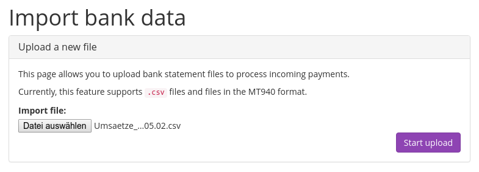

.. _`banktransfer`:

Bank transfer
=============

To accept payments with bank transfer, you only need to fill one important field in pretix' settings: In "Bank
account details" you should specify everything one needs to know to transfer money to you, e.g. your IBAN and BIC,
the name of your bank and for international transfers, preferably also your address and the bank's address.

pretix will automatically tell the user to include the order code in the payment reference so incoming transfers can
automatically be matched to payments.

Importing payment data
----------------------

The easiest way to import payment data is to download a CSV file from your online banking. Most banks provide a CSV
export of some sort. You can go to "Import bank data" in pretix to upload a new file:

If you upload a file for the first time, pretix will not know what information is contained in which column as every
bank builds completely different CSV files. Therefore, pretix will ask you for that information. It will show you the
data of the file you imported and ask you to define the column's meanings. You can select one column that contains
the payment date and one that contains the paid amount. You can select multiple columns that contain information
about the payer or the payment reference. All other columns will be ignored.

Once you continue, pretix will try to match the payments to the respective orders automatically. It will tell you how
many orders could be processed correctly and how many could not. You can then go back to the upload page to see all
transfers from your bank statement that are not yet matched to an order. Using the input field and the buttons on the
left of each transaction, you can manually enter an order code to match it to or just discard it from the list, e.g.
if the transaction is not related to the event at all.
