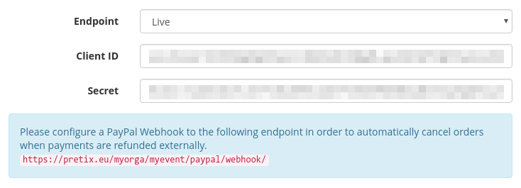
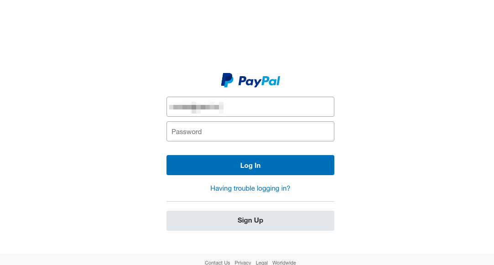
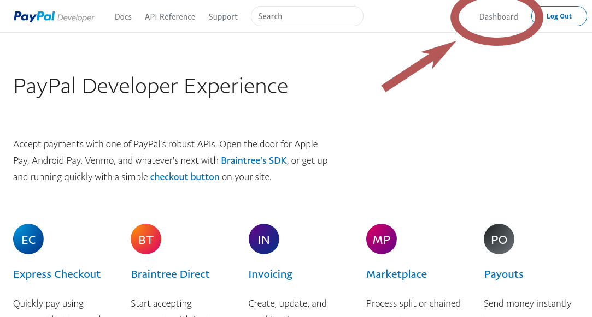
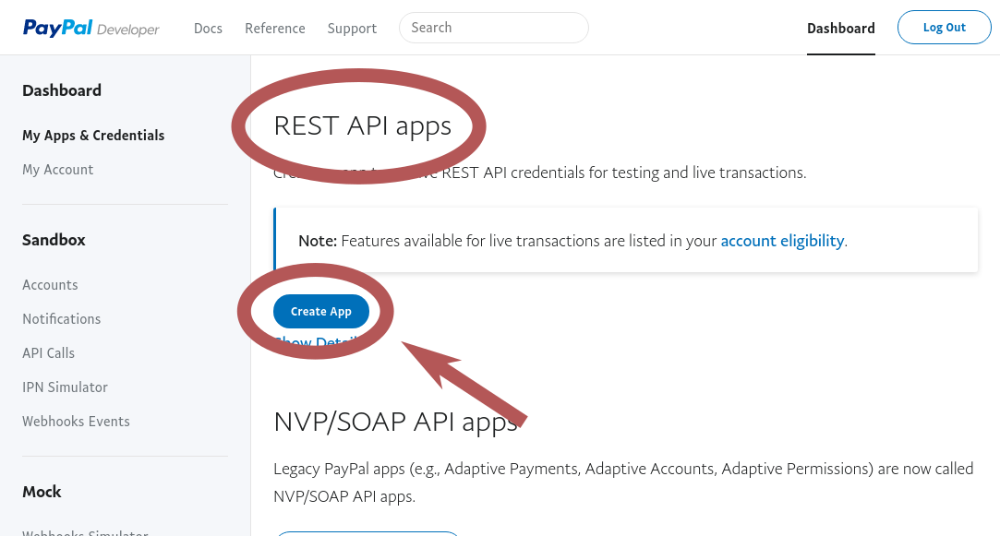
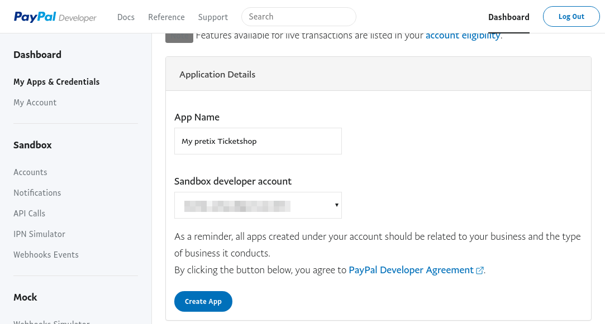
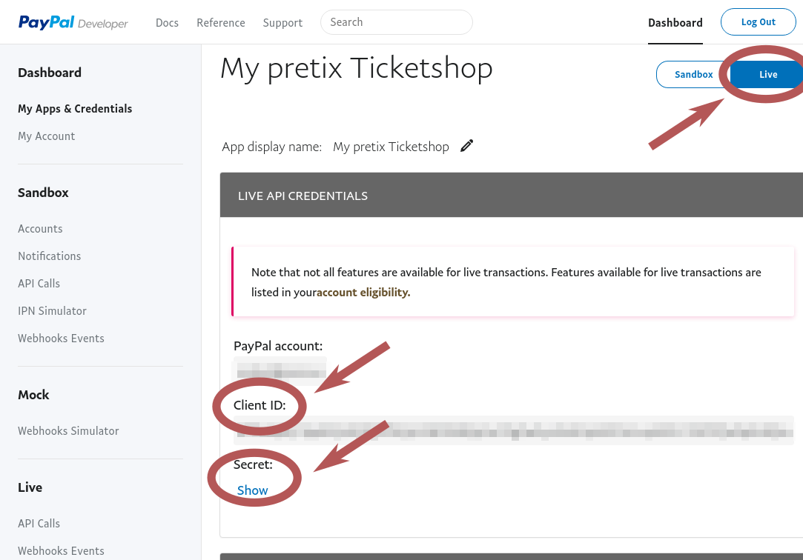
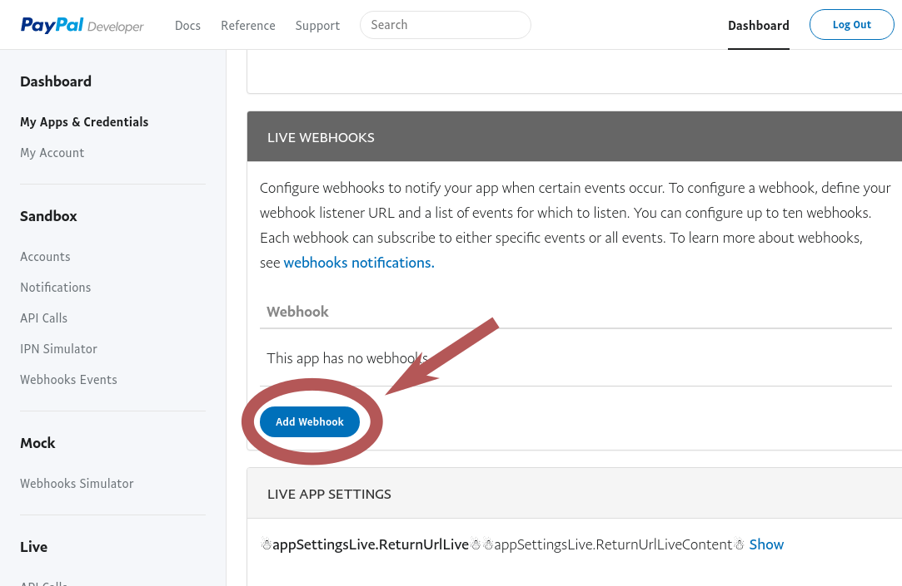
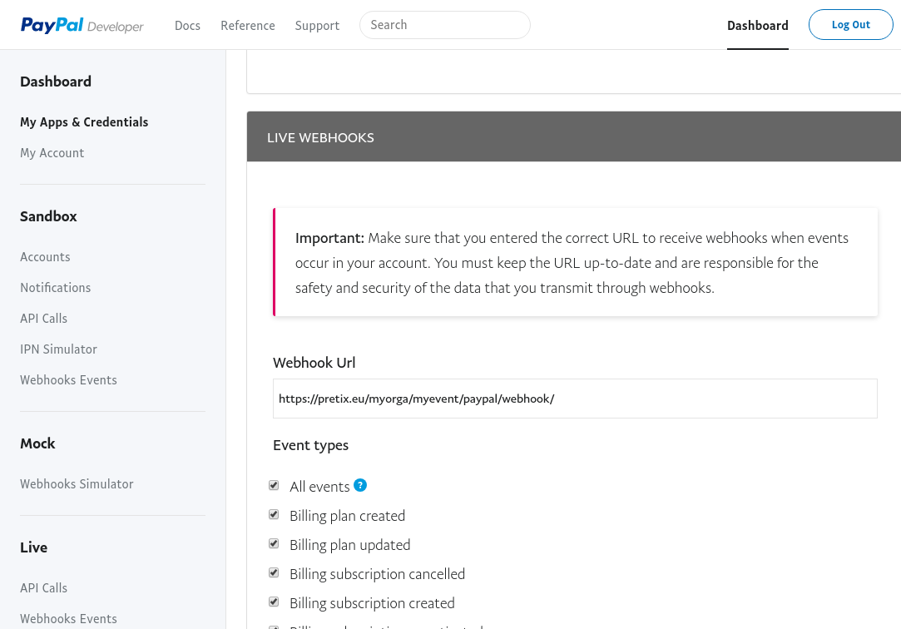

.. _`paypal`:

PayPal
======

.. note::

   If you use pretix Hosted, you do not longer need to go through this tedious process! You can
   just open the PayPal settings in the payment section of your event, click "Connect to PayPal"
   and log in to your PayPal account. The following guide is only required for self-hosted
   versions of pretix.

To integrate PayPal with pretix, you first need to have an active PayPal merchant account. If you do not already have a
PayPal account, you can create one on `paypal.com`_.
If you look into pretix' settings, you are required to fill in two keys:

Unfortunately, it is not straightforward how to get those keys from PayPal's website. In order to do so, you
need to go to `developer.paypal.com`_ to link the account to your pretix event.

.. warning::

   Unfortunately, PayPal tries to confuse you by having multiple APIs with different keys. You really need to
   go to https://developer.paypal.com for the API we use, not to your normal account settings!

Click on "Log In" in the top-right corner and log in with your PayPal account.

Then, click on "Dashboard" in the top-right corner.

In the dashboard, scroll down until you see the headline "REST API Apps". Click "Create App".

Enter any name for the application that helps you to identify it later. Then confirm with "Create App".

On the next page, before you do anything else, switch the mode on the right to "Live" to get the correct keys.
Then, copy the "Client ID" and the "Secret" and enter them into the appropriate fields in the payment settings in
pretix.

Finally, we need to create a webhook. The webhook tells PayPal to notify pretix e.g. if a payment gets cancelled so
pretix can cancel the ticket as well. If you have multiple events connected to your PayPal account, you need multiple
webhooks. To create one, scroll a bit down and click "Add Webhook".

Then, enter the webhook URL that you find on the pretix settings page. If you use pretix Hosted, this is always ``https://pretix.eu/_paypal/webhook/``.
Tick the box "All events" and save.

That's it, you are ready to go!

.. _paypal.com: https://www.paypal.com/webapps/mpp/account-selection
.. _developer.paypal.com: https://developer.paypal.com/
