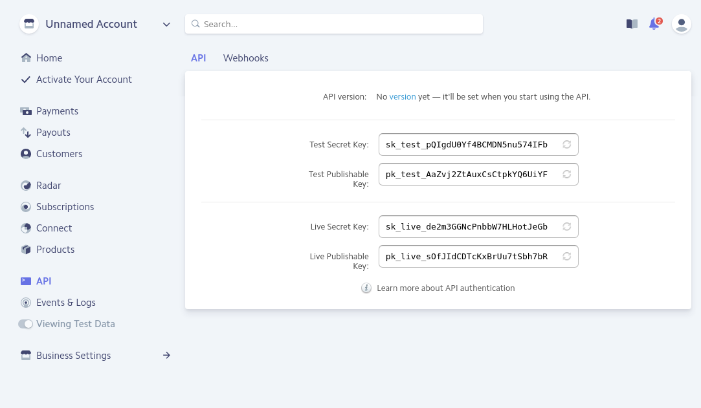
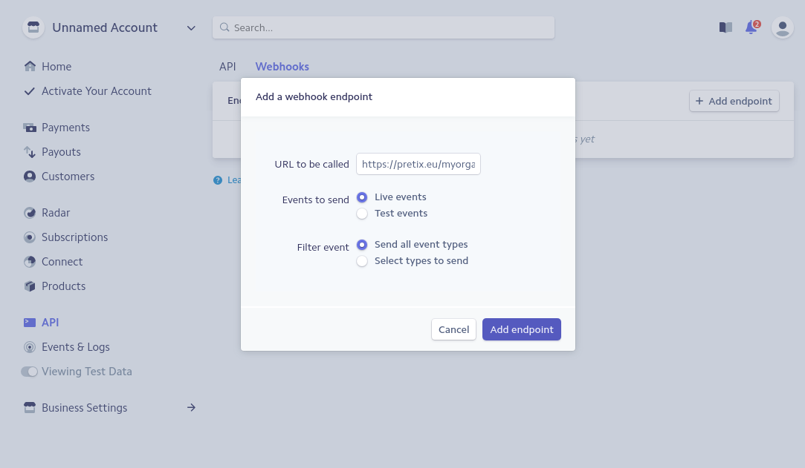

.. _stripe:

Stripe
======

To integrate Stripe with pretix, you first need to have an active Stripe merchant account. If you do not already have a
Stripe account, you can create one on `stripe.com`_. Then, click on "API" in the left navigation of the Stripe
Dashboard. As you can see in the following screenshot, you will be presented with two sets of API keys, one for test
and one for live payments. In each set, there is a secret and a publishable keys.

Choose one of the two sets and copy the two keys to the appropriate fields in pretix' settings. To perform actual
payments, you will need to use the live keys, but you can use the test keys to test the payment flow before you go live.
In test mode, you cannot use your real credit card, but only `test cards`_ like ``4242424242424242`` that you can
find in Stripe's documentation.

If you want Stripe to notify pretix automatically once a payment gets cancelled, so pretix can cancel the ticket as
well, you need to create a so-called webhook. To do so, click "Webhooks" on top of the page in the Stripe dashboard
that you are currently on. Then, click "Add endpoint" and enter the URL that you find directly below the key
configuration in pretix' settings.

Again, you can choose between live mode and test mode here.

.. _stripe.com: https://dashboard.stripe.com/register
.. _test cards: https://stripe.com/docs/testing#cards
